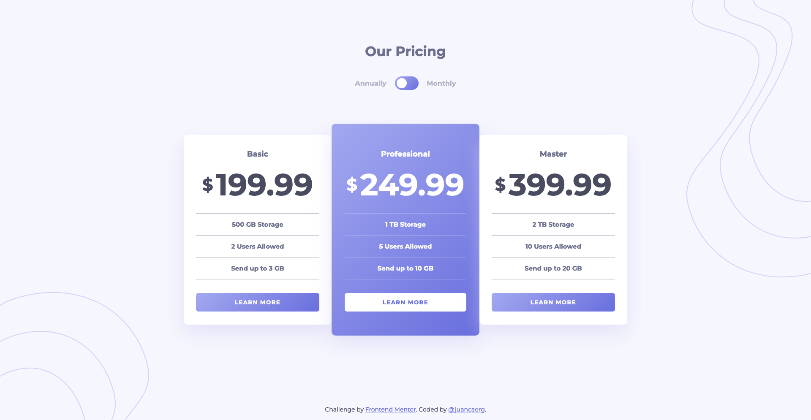

# Frontend Mentor - Pricing Component w/Toggle

This is a solution to the [Pricing component with toggle challenge on Frontend Mentor](https://www.frontendmentor.io/challenges/pricing-component-with-toggle-8vPwRMIC). Frontend Mentor challenges help you improve your coding skills by building realistic projects.

## Table of contents

- [Overview](#overview)
  - [The challenge](#the-challenge)
  - [Screenshot](#screenshot)
  - [Links](#links)
- [My process](#my-process)
  - [Built with](#built-with)
  - [What I learned](#what-i-learned)
  - [Continued development](#continued-development)
  - [Useful resources](#useful-resources)
- [Author](#author)
- [Acknowledgments](#acknowledgments)

## Overview

### The challenge

Users should be able to:

- View the optimal layout for the component depending on their device's screen size
- Control the toggle with both their mouse/trackpad and their keyboard
- **Bonus**: Complete the challenge with just HTML and CSS

### Screenshot



### Links

- Solution URL: [GitHub Repository](https://github.com/juancaorg/pricing-component)
- Live Site URL: [pricingcomponent.juanca.dev](https://pricingcomponent.juanca.dev)

## My process

### Built with

- Semantic HTML5 markup
- CSS custom properties
- Flexbox
- Mobile-first workflow
- Vanilla JavaScript

### What I learned

I learned how to build a CSS-Only Toggle Switch.

In a nutshell, to write an HTML switch use the following:

```html
<input type="checkbox" role="switch" />
```

We are achieving three different goals by using `role="switch"`:

- We provide a distinction between a checkbox and a toggle switch: at this point, humans may not be able to tell them apart (without styling, they both will look like checkboxes), but we have changed the component semantically, and machines will detect the difference, which gives way to the next two.
- Assistive technologies (AT) identify the checkbox as a switch: this is important because not only will they announce a toggle switch when they reach our component, but they will also read the value as "on" and "off" instead of "checked" and "unchecked."

- We provide a selection mechanism: now that we can differentiate between a checkbox and a toggle switch, we can also select them differently in CSS! We can offer different styles to checkboxes (input[type="checkbox"]) and switches (input[role="switch"]).

And for a simple toggle switch styling, you can use the following:

```css
input:where([type="checkbox"][role="switch"]) {
  -webkit-appearance: none;
  -moz-appearance: none;
  appearance: none;
  position: relative;
  font-size: inherit;
  width: 2em;
  height: 1em;
  box-sizing: content-box;
  border: 1px solid;
  border-radius: 1em;
  vertical-align: text-bottom;
  margin: auto;
  color: inherit;
}

input:where([type="checkbox"][role="switch"])::before {
  content: "";
  position: absolute;
  top: 50%;
  left: 0;
  transform: translate(0, -50%);
  box-sizing: border-box;
  width: 0.7em;
  height: 0.7em;
  margin: 0 0.15em;
  border: 1px solid;
  border-radius: 50%;
  background: currentcolor;
}

input:where([type="checkbox"][role="switch"]):checked::before {
  left: 1em;
}
```

Of course, the toggle switch styling for this project is different, but I started with the code above as a boilerplate.

### Continued development

You get better by building, so keep building. Nothing else to add.

### Useful resources

- [Creating a CSS-Only Toggle Switch](https://alvaromontoro.com/blog/68017/creating-a-css-only-toggle-switch) - This is the main article where I learned how to build the CSS-Only toggle switch. Full credit to the author.

## Author

- Website - [juanca.org](https://www.juanca.org)
- Frontend Mentor - [@juancaorg](https://www.frontendmentor.io/profile/juancaorg)
- Twitter - [@juancaorg](https://twitter.com/juancaorg)

## Acknowledgments

Again, this project would have been much difficult to complete without the help of [Alvaro Montoro](https://alvaromontoro.com/) and [his article](https://alvaromontoro.com/blog/68017/creating-a-css-only-toggle-switch).

Check out his blog if you want to learn more about Frontend Development!
